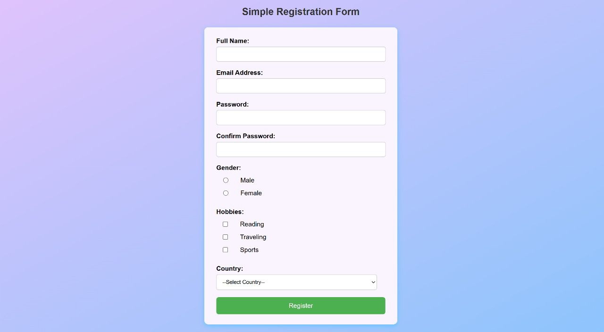

# 📝 Simple Registration Form (HTML + PHP + MySQL)

This is a basic web-based registration form built using **HTML**, **CSS**, and **PHP**. Submitted form data is validated and saved to a MySQL database, then displayed on a confirmation page.

## 📁 Files Included

- `registration.html` – The front-end registration form  
- `register.php` – Processes form submission, validates input, saves to database, and displays a confirmation  

## 🧾 Features

- Collects user input:
  - Full Name
  - Email
  - Password & Confirm Password
  - Gender (radio buttons)
  - Hobbies (checkboxes)
  - Country (dropdown)
- Validates password match
- Escapes HTML to prevent XSS
- Saves data to a **MySQL** database (`users` table in `registration_db`)
- Styled using internal CSS with a modern container design

## 🛠️ How to Run

1. Start your local server (e.g., XAMPP)
2. Place the project files in the `htdocs` directory
3. Open `phpMyAdmin` and create a database:
   ```
   CREATE DATABASE registration_db;
   ```
4. Create the `users` table:
   ```sql
   CREATE TABLE users (
     id INT AUTO_INCREMENT PRIMARY KEY,
     fullname VARCHAR(100),
     email VARCHAR(100),
     password VARCHAR(255),
     gender VARCHAR(10),
     hobbies TEXT,
     country VARCHAR(50)
   );
   ```
5. Visit `http://localhost/registration.html` in your browser
6. Fill in the form and submit to see your data saved and confirmed


## ✅ Demo Preview

  

---

